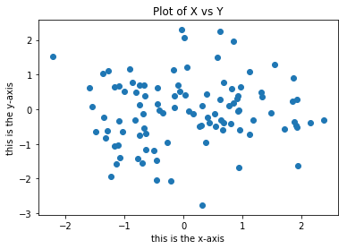

# CAPÍTULO 2 - APRENDIZADO ESTATÍSTICO

## 2.1. O que é aprendizado estatístico?

   Para ilustrarmos nosso estudo de aprendizado estatístico, comecemos com um exemplo simples. Suponha que somos consultores de estatística contratados por um clientepara prover consultoria em como aumentar as vendas de um produto em particular. O conjunto de dados $Propagandas$ consiste das vendas daquele produto em 200 mercados diferentes,juntamente com orçamentos de propagandas para cada um desses mercados para três diferentes mídias: $TV$, $rádio$ e $jornal$. 
     Não é possível para nosso cliente aumentar diretamente as vendas do produto. Por outro lado, é possível controlar os gastos em cada uma das três mídias. Portanto, se determinarmos que há uma associação entre propagandas e vendas, podemos instruir nosso cliente a ajustar os orçamentos de propagandas, aumentando então as vendas. Em outras palavras, nosso objetivo é desenvolver um modelo preciso que possa ser utilizado para prever vendas com base nos três orçamentos de mídia.
     Neste contexto, os orçamentos de propagandas são variáveis de entrada enquanto $vendas$ são variáveis de saída. As variáveis de entrada são tipicamente denotadas por $X$. $X_{1}$ seria o orçamento da $TV$, $X_{2}$ o orçamento do $rádio$, e $X_{3}$ o orçamento do $jornal$. As entradas são chamadas por diversos nomes, como variáveis indepenndentes, preditores, características, ou apenas variáveis. A variável de saída (no caso "vendas) é frequentemente chamdada de 
resposta ou variável dependente, e é tipicamente denotada por $Y$.
     


<h5> Figura 2.1. </h5>
<i> O dataset $Propagandas$. O gráfico mostra $vendas$, em milhares de unidades, como função do orçamento para $TV$, $rádio$ e $jornal$, em milhares de dólares, para 200 mercados diferentes. Em cada gráfico mostramos o ajuste por mínimos quadrados simples de $vendas$ para cada variável. Em outras palavras, cada linha azul representa um modelo simples que pode ser utilizado para prever $vendas$ utilizando $TV$, $rádio$ e $jornal$, respectivamente. </i>

   Suponha que observamos uma resposta quantitativa $Y$ e p preditores $X_{1}$, $X_{2}$ e $X_{p}$. Assumimos que há algum 
relacionamento entre $Y$ e $X$ = ($X_{1}$,$X_{2}$,...,$X_{p}$), o que pode ser escrito na forma geral

<h4 align="center">                                             $Y = f(X) +  ε$  </h4>

<h4 align = "right"> (2.1) </h4>

Aqui $f$ é uma função fixa mas desconhecida de $X_{1}$,$X_{2}$,...,$X_{p}$, e $ε$ é um termo de erro aleatório, que é independente de 
$X$ e possui média zero. Nessa formulação, $f$ representa a informação sistemática que $X$ fornece sobre $Y$. 


Em outro exemplo, considere um conjunto de dados $salário$ e um gráfico de $salário$ $x$ $anos$ $de$ $estudo$ para 30 pessoas.
O gráfico sugere que é possível prever o salário por meio do número de anos de estudo de uma pessoa. No entanto, a função
$f$ que conecta a variável de entrada à variável de saída é em geral desconhecida. Dessa forma, é possivel estimar $f$ com
base nos pontos observados. Como "salário" é um conjunto de dados simulado, $f$ é conhecida e representada pela curva azul no painel direito da Figura 2.2. As linhas verticais representam os termos de erro $ε$. Notamos que algumas das 30 observações estão acima da curva azul e algumas estão abaixo; logo, os erros possue média aproximadamente igual a zero. 
    Em geral, a função $f$ pode envolver mais que uma variável de entrada. Na figura 2.3. colocamos em um gráfico $salário$ como função de $anos$ $de$ $estudo$ e $prestígio$. Daí, $f$ é uma superfície bidimensional que deve ser estimada com base nos dados observados.  


<h5> Figura 2.2. </h5>
<i>O conjunto de dados $Salário$. À esquerda: os pontos vermelhos são os valores observados de $salário$ (em dezenas de milhares de dólares) e $anos$ de $estudo$ para 30 indivíduos. À direita: A curva azul representa a  verdadeira relação oculta entre $salário$ e $anos$ $de$ $estudo$, a qual é geralmente desconhecida (mas é conhecida neste caso, pois os dados são simulados). As linhas pretas representam o erro associado a cada observação. Note que alguns erros são positivos (acima da curva azul) e alguns são negativos (abaixo da curva). No geral, estes erros possuem média aproximada de zero.</i>

  Essencialmente, aprendizado estatístico se refere a um conjunto de abordagens para estimar $f$. 

## 2.1.1. Por que estimar f?

   Há duas razões principais que precisaremos para estimar $f$: predição e infêrencia.

### Predição

   Em muitas situações, um conjunto de entradas $X$ estão disponíveis, mas a saída $Y$ não pode ser facilmente obtida.
Neste contexto, como o termo de erro tende a ter média zero, podemos prever $Y$ usando

<h4 align="center"> $\bar{Y}$ = $\bar{f}$($X$)           </h4>              

<h4 align = "right"> (2.2) </h4>

onde $\bar{f}$ representa nossa estimativa para f, e $\bar{Y}$ representa a predição resultante para a $Y$. Desta forma,  $\bar{f}$ é frequentemente tratada como uma caixa preta, no sentido em que não estamos tipicamente preocupados com a forma exata de $\bar{f}$, visto que fornece predições corretas para $Y$.


<h5> Figura 2.3.</h5>
<i> O gráfico apresenta $salário$ como função de $anos$ $de$ $estudo$ e $prestígio$ no conjunto de dados $Salário$. A curva azul representa a verdadeira relação oculta entre $salário$ e $anos de educação$ e $prestígio$, a qual é conhecida, já que os dados são simulados. Os pontos vermelhos indicam os valores observados destas quantidades para 30 indivíduos. </i>
    
   Por exemplo, suponha que $X_{1}$,...,$X_{p}$ sejam características de uma amostra de sangue de um paciente que pode ser
medida em um laboratório, e $Y$ a varíavel que armazena o risco do paciente reagir negativamente a uma droga em particular. Naturalmente, será procurado prever $Y$ utilizando $X$, já que podemos evitar a administração da droga em questão
para pacientes que possuem alto risco de reagir negativamente (isto é para pacientes com estimativas altas de $Y$).
    
   A acurácia de $\bar{Y}$ como predição para y depende de duas quantidades, que chamaremos de erro redutível e erro irredutível. Em geral $\bar{f}$ não será uma estimativa perfeita para f, e essa inacurácia introduzirá algum erro. Este erro é redutível porque podemos potencialmente aumentar a acurácia de $\bar{Y}$ usando a técnica de aprendizado estatístico mais adequada para estimar $f$. No entanto, mesmo que fosse possível formar uma estimativa perfeita para f, tal q ue nossa resposta estimada tivesse a forma $\bar{Y}$ = $f(X)$, nossa predição ainda possuiria erros! Isto acontece porque $Y$ é também uma 
função de ε, que, por definição, não pode ser prevista utilizando $X$. Portanto, variabilidade associada a ε também 
afeta a acurácia de nossas predições. Isto é conhecido como erro irredutível, pois não importa o quão bem estimemos
$f$, não poderemos diminuir o erro introduzido por ε.

   Por que o erro irredutível é maior que zero? A quantidade ε pode conter varíaveis não mensuradas que são úteis ao
prever $Y$: já que não as medimos, estas não podem ser utilizadas para a predição de $f$. Por exemplo, o risco de uma reação adversa pode variar em um paciente em um dado dia, dependendo da variação da manufatura da droga ou da sensação
de bem-estar geral naquele dia.

   Considere uma dada estimativa $\bar{f}$ e um conjunto de preditores X, os quais fornecem a predição $\bar{Y}$ = $\bar{f}$(X). Assumiremos por um momento que ambos $\bar{f}$ e X estão fixados. Daí, é fácil mostrar que 

<h4 align = "center">        $E$($Y$ - $\bar{Y}$)²   =   $E$[$f(X)$ + $E$ - $\bar{f}$($X$)]²   =   [$f(X)$ - $\bar{f}$($X$)]² + $Var(ε)$ </h4>

<h4 align = "right"> (2.3) </h4>

 <h4 align = "left">  [$f(X)$ - $\bar{f}$($X$)]²  = termo redutível </h4>

  <h4 align = "left">   $Var(ε)$ - termo irredutível </h4>

onde $E$($Y$ - $\bar{Y}$)² representa a média, ou valor esperado, da diferença ao quadrado entre os valores previsto e verdadeiro
valor de $Y$, e $Var$(ε) representa a variância associada com o termo de erro ε.
    
   Nosso foco será em técnicas para estimar f com o objetivo de minimizar o erro redutível.

### Inferência

   Frequentemente, estamos interessados em compreender a forma como Y é afetado enquanto $X_{1}$,...,$X_{p}$ muda. Nesta situação desejamos estimar $f$, mas nosso objetivo não é necessariamente fazer predições para $Y$. Nós queremos entender o relacionamento entre $X$ e $Y$, ou mais especificamente, entender como $Y$ muda como função de $X_{1}$,...,$X_{p}$. Agora $\bar{f}$ não pode ser tratada como uma caixa preta, pois precisamos saber sua forma exata. Neste contexto, podemos estar interessados em responder as seguintes perguntas:

####  Quais preditores estão associados à resposta?

   Frequentemente apenas uma pequena fração dos preditores disponíveis estão substancialmente associados com $Y$. Identificar os preditores importantes dentre um grande conjunto de possíveis varíaveis pode ser extremamente útil, dependendo da aplicação.

#### Qual o relacionamento entre a resposta e cada preditor?

   Alguns preditores podem possuir uma relação positiva com $Y$, no senso de que, o aumento do preditor é associado
com o aumento dos valores de $Y$. outros preditores podem possuir uma relação oposta. Dependendo da complexidade de $f$,o relacionamento entre a resposta e um dado preditor pode também depender dos valores dos outros preditores.

#### O relacionamento entre Y e cada preditor pode ser resumido adequadamente utilizando uma equação linear, ou o relacionamento é mais complicado?

   Historicamente, a maioria dos métodos para estimar f têm tomado uma forma linear. Em algumas situações, tal
suposição é coerente ou até desejável. Mas, frequentemente, o verdadeiro relacionamento é mais complicado, no qual um
modelo linear pode não fornecer uma representação precisa do relacionamento entre as variáveis de entrada e saída.

   Por exemplo, considere uma empresa que está interessada em conduzir uma campanha de marketing. O objetivo é identificar indivíduos que responderão positivamente a uma correspondência, baseando-se em observações de variáveis demográficas medidas para cada indivíduo. Neste caso, as variáveis demográficas servem como preditores, e as respostas à 
campanha de marketing (positivas ou negativas) servem como resultado. A empresa não está interessada em obter uma 
compreensão profunda dos relacionamentos entre cada preditor individual e a resposta; em vez disso, a empresa simplesmente deseja um modelo preciso para predizer a resposta utilizando os preditores.
    Este é um exemplo de modelar com o objetivo de prever.


   Pode-se estar interessado em responder perguntas tais como:

<h5> Qual mídia contribui para as vendas? </h5>

<h5> Qual mídia gera o maior aumento nas vendas? </h5>

<h5> Qual parte do aumento das vendas é associada a um dado aumento nas propagandas de TV?    </h5>

   Esta situação cai no paradigma de inferência. Outro exemplo envolve a modelagem da marca de um produto que o 
consumidor pode adqurir baseado em variáveis como preço, localização do estoque, descontos, preço competitivo, entre
outros. Nesta situação pode-se estar interessado em como cada uma das variáveis afeta a probabilidade de compra. Por
exemplo, qual será o efeito nas vendas ao mudar o preço de um produto? Este é um exemplo de modelagem para inferência.

   Pode-se modelar um problema com foco em inferência e predição. Por exemplo, no cenário da venda de imóveis, pode-se
 relacionar os valores de casas a entradas como nível de criminalidade, zoneamento, distância até um rio, qualidade do
 ar, escolas, níveis de salário dos moradores, entre outros. Neste caso podemos estar interessados em como as variáveis de entrada individuais afetam os preços - ou seja, quanto a mais valerá uma casa se ela tiver vista para um rio? Este é um problema de inferência. Por outro lado, alguém pode estar simplesmente interessado em prever o valor de uma casa dadas suas características: a casa está acima do valor do mercado ou abaixo? Este é um problema de predição.
 
   Dependendo se nosso objetivo final é predição, inferência ou uma combinação de ambos, diferentes métodos para estimar $f$ podem ser apropriados. Por exemplo, modelos lineares são relativamente simples e facilmente interpretados,
mas podem conduzir a predições não tão precisas como outras abordagens. No entanto, alguns das abordagens altamente
não-lineares que serão discutidas futuramente podem produzir predições de $Y$ com grande acurácia, mas sendo menos interpretáveis, o que torna a inferência mais desafiadora.

## 2.1.2. Como estimar f?

   Sempre assumimos que observamos um conjunto de n pontos diferentes. Estas observações são denominadas "dados de treino" porque utilizaremos estas observações para treinar ou ensinar nosso método a estimar f. Seja $x_{ij}$ a representação do valor do j-ésimo preditor, ou entrada, para a observação i, onde i = 1,2,...,n e j = 1,2,...,p, e seja yi a representação da variável de resposta para a i-ésima observação. Daí, nossos dados de treino consistem em
{($x_{1}$,$y_{1}$),($x_{2}$,$y_{2}$),...,($x_{n}$,$y_{n}$)} onde $x_{i}$ = ($x_{i1}$,$x_{i2}$,...,$x_{ip})^T$.

   Nosso objetivo é aplicar um método de aprendizado estatístico aos dados de treino para estimar a função desconhecida f. Em outras palavras, queremos encontrar uma função $\bar{f}$ tal que Y ≅ $\bar{f}$(x) para cada observação (X,Y). 
Generalizando, a maioria dos métodos de aprendizado estatístico para esta tarefa podem ser caracterizados como 
paramétricos ou não paramétricos.

### Métodos paramétricos

Métodos paramétricos envolvem uma modelagem com dois passos. 

1. Primeiramente, fazemos uma suposição sobre a forma de f. Por exemplo, uma suposiçãos simples é que f é linear em X:

<h4 align="center"> $f(X)$ = $β_{0}$ + $β_{1}$$X_{1}$ + $β_{2}$$X_{2}$ + $β_{3}$$X_{3}$ + ... + $β_{p}$$X_{p}$.   </h4>

<h4 align = "right"> (2.4)   </h4>

Este modelo é linear. Uma vez que assumimos que f é linear, o problema de estimar f é simplificado em grane parte. Em vez de estimar uma função inteiramente arbitrária p-dimensional $f(X)$, só é necessário estimar os p+1 coeficientes $β_{0}$,$β_{1}$,...,$β_{p}$.

Depois que um modelo foi selecionado, precisamos de um procedimento que utiliza os dados de treino para treinar ou
ajustar o modelo. No caso do modelo linear anterior, precisamos estimar os parâmetros β0,β1,...,βp. Isto é, queremos encontrar valores destes parâmetros tais que

<h4 align="center"> $Y$ = $β_{0}$ + $β_{1}$$X_{1}$ + $β_{2}$$X_{2}$ + $β_{3}$$X_{3}$ + ... + $β_{p}$$X_{p}$.   </h4>    

   A abordagem mais comum para se ajustar o modelo é chamada de mínimos quadrados. No entanto, esta é uma das diversas formas de ajustar o modelo linear. 
   

<h5> Figura 2.4.</h5>
<i>Um ajuste linear por mínimos quadrados para os dados $Salário$ da figura 2.3. As observações são mostradas em vermelho, e o plano amarelo indica o ajuste por mínimos quadrados aos dados.</i>
   
   O modelo descrito acima é denominado paramétrico; reduz o problema de estimar $f$ para estimar um conjunto de parâmetros. Assumir uma forma paramétrica para $f$ simplifica o problema de estimar $f$, pois é geralmente muito mais fácil estimar um conjunto de parâmetros em um modelo linear do que ajustar uma função inteiramente arbritária $f$. 
   A possível desvantagem de uma abordagem paramétrica é que geralmente o modelo que escolhemos não corresponde à verdadeira forma de $f$. Se o modelo escolhido for muito longe do verdadeiro $f$, então nossa estimativa será fraca. Podemos tentar resolver esse problema escolhendo modelos flexíveis que podem se ajustar a diferentes possíveis formas funcionais a $f$. Mas, em geral, ajustar um modelo flexível requer a estimativa de um número maior de parâmetros. Estes modelos mais complexos podem resultar em um fenômeno conhecido como "overfitting dos dados", o que significa essencialmente que eles seguem os erros muito de perto. 

   Agora utilizaremos uma abordagem paramétrica aplicada aos dados $salário$. Temos um modelo linear da forma
   
<h4 align = "center">       $salário$ =  $β_{0}$ $+$ $β_{1}$ $x$ $educação$ + $β_{2}$ $x$ $prestígio$ </h4>

Já que assumimos um relacionamento linear entre a resposta e os dois preditores, o problema se reduz a estimar  $β_{0}$, $β_{1}$ e $β_{2}$, nos quais utilizamos a regressão linear por mínimos quadrados. No entanto, a verdadeira função $f$ possui certa curvatura que não é capturada no ajuste linear. Comparando a figura 2.3. à figura 2.4., vemos que o ajuste linear dado na figura 2.4. não é bem verdadeiro: a verdadeira $f$ possui certa curvatura que não é capturada no ajuste lineaar. Mas, o ajuste linear ainda parece razoável ao capturar a relação positiva entre anos de educação e salário, assim como a levemente menor relação entre prestígio e salário. É o melhor que podemos fazer com um pequeno número de observações.

### Métodos não-paramétricos 


<h5> Figura 2.5.</h5>
<i>Um ajuste thin-plate spline suave aos dados $Salário$ da figura 2.3. é mostrado em amarelo; as observações estão apresentadas em vermelho.</i>

Métodos não-paramétricos não fazem suposições explícitas sobre a forma funcional de $f$. Em vez disso, estes procuram uma estimativa de $f$ que chega tão perto quanto o possível dos pontos sem estimativas tão grosseiras. Tais abordagens possuem uma grande vantagem sobre abordagens paramétricas: ao evitar a suposição de uma forma particular para $f$, elas possuem o potencial de ajustar-se adequadamente a um espectro maior de possíveis formas para $f$. Qualquer método paramétrico traz a possibilidade da forma funcional utilizada para estimar $f$ ser muito diferente do verdadeiro $f$, e, consequentemente, o modelo resultante não se ajustará bem aos dados. 

Em constraste, abordagens não-paramétricas possuem uma grande desvantagem: como elas não reduzem o problema de estimar $f$ com um pequeno número de parâmetros, são necessárias um grande número de observações (se comparado com o número necessário no método paramétrico) para que se obtenha uma estimativa adequada para $f$.

Podemos utilizar um método não-paramétrico com os dados $Salário$. Esta abordagem não impõe nenhum modelo pré-especificado em $f$. Em vez disso, tenta prduzir uma estimativa para $f$ que se aproxime o máximo possível dos dados observados. Neste caso, o ajuste não-paramétrico produziu uma estimativa precisa do verdadeiro $f$. Pode-se selecionar um grau de suavidade no ajuste, mas deve-se ter cuidado com o "overfitting", pois é uma situação indesejada, já que o ajuste obtido não fornecerá estimativas precisas das respostas para novas observações que não eram parte dos dados de treinos originais.

Um exemplo de abordagem não-paramétrica ao ajustar os dados $Salário$ é mostrado na figura 2.5. Um <i>thin-plate spline</i> é utilizado para estimar $f$. Esta abordagem não impõe nenhum modelo pré-especificado em $f$. Em vez disso, tenta produzir uma estimativa para $f$ a mais próxima possível dos dados observados, sujeito ao ajuste suave. Neste caso, o método não-paramétrico produziu uma estimativa notavelmente precisa da verdadeira $f$ mostrada na figura 2.3. Para se ajustar um thin plate spline, o analista de dados deve selecionar um nível de suavidade. A figura 2.6. mostra o mesmo ajuste thin-plate spline utilizando um nível menor de suavidade, permitindo um ajuste mais "grosseiro". O resultado da estimativa ajusta os dados observados perfeitamente! No entanto, o ajuste mostrado na figura 2.6. é bem mais variável que a verdadeira função $f$ da figura 2.3. Este é um exemplo de "overfitting" dos dados. É uma situação indesejável porque o ajuste obtido não entregará estimativas precisas da resposta para novas observações (observações que não eram parte original do conjunto de dados de treino).

Portanto, há vantagens e desvantagens ao se utilizar métodos paramétricos e não-paramétricos para aprendizado estatístico. 


<h5> Figura 2.6.</h5>
<i>Um ajuste thin-plate spline mais "grosseiro" aos dados $Salário$ da figura 2.3. Este ajuste possui erros nulos nos dados de treino. </i>

## 2.1.3. A relação de compromisso entre a acurácia da predição e a interpretabilidade de um modelo

Alguns métodos são menos flexíveis ou mais restritos, no sentido de que podem produzir apenas um pequeno espectro de formas para estimar $f$. Por exemplo, regressão linear é uma abordagem relativamente inflexível, pois pode gerar apenas funções lineares como as linhas mostradas na Figura 2.1. ou o plano mostrado na figura 2.4. 

Outros métodos, como <i>thin-plate splines</i>, mostrados nas figuras 2.5. e 2.6., são considerados mais flexíveis porque podem gerar um espectro muito maior de 
possíveis formas de estimar $f$.

Pode-se perguntar: por que alguém escolheria um método mais restritivo em vez de um mais flexível? Há um grande número de razões para preferirmos um modelo mais restritivo. Se estamos principalmente interessados em inferência, então modelos restritivos são muito mais interpretáveis. Por exemplo, quando o objetivo é inferência, o modelo linear é uma boa opção, pois é fácil de entender a relação entre $y$ e $X_{1}$,$X_{2}$,...,$X_{p}$. Modelos muito flexíveis, como os splines mostrados nas figuras 2.5. e 2.6.., e métodos de <i>boosting</i> podem levar a estimativas complicadas de $f$, dificultando o entendimento de como um preditor individual é associado à resposta.

A figura 2.7. fornece uma ilustração da relação de compromisso entre flexibilidade e interpretabilidade para alguns do métodos citados neste livro. Por exemplo, a regressão linear por mínimos quadrados é relativamente inflexível mas é bem interpretável. O lasso depende do modelo linear (2.4), mas utiliza um procedimento de ajuste alternativo para estimar os coeficientes. Este novo procedimento é mais restritivo ao estimar os coeficientes, e alguns são igualados a zero. Desta forma, o lasso é uma abordagem mais flexível que a regressão linear, porque no modelo final a varíavel de resposta será relacionada apenas a um pequeno subconjunto de preditores - aqueles com coeficientes não-nulos. 

<i>Modelos aditivos generalizados </i> (GAMs) extendem o modelo linear para permitir certas relações não-lineares. Consequentemente, são mais flexíveis que regressão linear. Eles também são de certa forma menos interpretáveis que regressão linear, pois o relacionamento entre cada preditor e a resposta agora é modelado utilizando uma curva. Finalmente, métodos completamente não-lineares como <i>bagging</i>, <i>boosting</i> ou <i>máquinas de vetores de suporte</i> com núcleos não-lineares são métodos altamente flexíveis e mais difíceis de interpretar.

Estabelecemos que quando o objetivo é a inferência, há claras vantagens em utilizar métodos de aprendizado estatístico simples e relativamente inflexíveis. Em alguns casos, no entanto, estamos interessados apenas em predição, e a interpretabilidade do modelo preditivo não é de interesse. Por exemplo, se procuramos desenvolver um algoritmo para prever o preço de um estoque, nossa única condição é que o algoritmo seja preciso (interpretabilidade não é uma preocupação). Neste contexto, podemos esperar que a melhor abordagem é o modelo mais flexível disponível. No entanto, não é sempre o caso! Frequentemente encontraremos predições mais precisas utilizando um método menos flexível. Este fenômeno, que pode parecer não-intuitivo, é relacionado com o potencial para "overfitting" em métodos altamente flexíveis. Vimos um exemplo disto na figura 2.6. 


<h5> Figura 2.7 </h5>
A representação da relação de compromisso entre flexibilidade e interpretabilidade, utilizando diferentes métodos de aprendizado estatístico. Em geral, à medida que a flexibilidade de um método aumenta, sua interpretabilidade dimimnui.

## 2.1.4. Aprendizado supervisionado vs. aprendizado não-supervisionado

A maioria dos problemas de aprendizado estatístico se encaixam em uma das duas categorias: supervisionado ou não-supervisionado. Até agora só discutimos problemas de aprendizado supervisionado. Para cada observação das medidas de predição $x_{i}$, i = 1,...,n há uma medida de resposta associada $y_{i}$. Desejamos ajustar um modelo que relaciona a resposta aos preditores, com o objetivo de prever a resposta em futuras observações ou obter melhor entendimento da relação entre a resposta e os preditores (inferência). Muitos métodos de aprendizado estatístico clássicos como regressão linear e regressão logística operam no domínio do aprendizado supervisionado. 

No entanto, o aprendizado não-supervisionado descreve uma situação mais desafiante, na qual para cada observação i = 1,...,n observamos um vetor de medidas $x_{i}$, mas nenhuma resposta associada $y_{i}$. Não é possível ajustar um modelo de regressão linear, pois não há variável de resposta para predizer. A situação é denominada não-supervisionada porque não há uma resposta que supervisione nossa análise. 

Podemos procurar entender as relações entre as variáveis ou as observações. Uma ferramenta de aprendizado estatístico que podemos utilizar neste contexto é o clustering. O foco do clustering é verificar, com base em $x_{1}$,...,$x_{n}$, se as observações caem em grupos relativamente distintos. Por exemplo, em um estudo de segmentação de mercado podemos observar múltiplas características (variáveis) para potenciais clientes, como CEP, renda familiar e hábitos de compra. Podemos acreditar que os consumidores caem em diferentes grupos, como de grandes gastos versus pequenos gastos. Se as informações sobre os padrões de hábitos de compra estivessem disponíveis, uma análise supervisionada seria possível. No entanto, estas informações não estão disponíveis (não podemos determinar se um cliente gasta muito ou pouco). Neste contexto, podemos tentar agrupar os clientes com base nas variáveis medidas com o objetivo de identificar grupos distintos de clientes em potencial. Identificar tais grupos pode ser de interesse, pois estes podem diferir entre si, como, por exemplo, hábitos de compras.

Ilustraremos um problema de clustering. Podemos colocar em um gráfico 150 observações com medidas em duas varíaveis ($X_{1}$ e $X_{2}$). Cada observação corresponde a um de três grupos distintos. Pode haver uma sobreposição entre os grupos, e isso torna a tarefa algo mais desafiador. Não é esperado deste método colocar todos os pontos sobrepostos nos seus grupos corretos. 

No entanto, pode-se encontrar dados que possuam mais de duas variáveis. Neste caso não podemos colocar em um gráfico as observações tão facilmente. Por exemplo, se há $p$ variáveis no nosso conjunto de dados, então <sup>$p$$(p-1)$</sup>&frasl;<sub>2</sub> gráficos de dispersão distintos podem ser feitos, e então a identificação visual torna-se algo inviável. Por essa razão, métodos automatizados de clustering são importantes.


<h5> Figura 2.8</h5> 
<i>Clustering de um conjunto de dados envolvendo três grupos. Cada grupo é representado com um símbolo diferente. À esquerda: Os três grupos estão bem separados. Neste contexto, uma abordagem de clustering identificaria com sucesso os três grupos. À direita: Há sobreposição entre os grupos. Utilizar a abordagem clustering é mais desafiadora nessa situação.</i>

Muitos problemas caem naturalmente nos paradigmas de aprendizado supervisionado ou não-supervisionado. No entanto, às vezes definir se uma análise deve ser considerada supervisionada ou não é mais complicado. Por exemplo, suponha que temos um conjunto de n observações. Para m das observações, onde $m < n$, temos medidas de predição e resposta. Para as $n-m$ observações restantes, temos medidas de predição mas nenhuma medida de resposta. Tal cenário pode aparecer quando as predições podem ser medidas de forma relativamente barata mas as respostas correspondentes são bem mais caras de se obter. Nós nos referimos a este contexto como aprendizado "semi-supervisionado". Neste contexto, desejamos usar um método de aprendizado de máquina que incorpora as m observações para quais as respostas estão disponíveis, mas também incorporam as n-m observações que não possuem resposta. 

## 2.1.5. Problemas de regressão versus problemas de classificação

Variáveis podem ser caracterizadas como qualitativas ou quantitativas. Variáveis quantitativas assumem valores numéricos (idade, altura, salário, etc.). Por outro lado, variáveis qualitativas assumem valores em uma de $K$ classes diferentes, ou categorias (gênero, marca de um produto, diagnóstico de câncer, etc.).

Tendemos a nos referir a problemas com uma resposta quantitativa como problemas de regressão, e a problemas com uma resposta qualitativa como problemas de classificação. Regressão linear por mínimos quadrados é normalmente usada com uma resposta quantitativa, enquanto regressão logística é tipicamente usada com uma resposta qualitativa. Alguns métodos estatísticos, como os k-vizinhos mais próximos e boosting, podem ser utilizados em ambas as respostas.

Nós tendemos a selecionar métodos de aprendizado estatístico com base se a resposta é quantitativa ou qualitativa; por exemplo, podemos utilizar regressão linear quando a resposta é quantitativa e regressão logística quando é qualitativa. No entanto, é considerado menos importante se os preditores são qualitativos ou quantitativos.

## 2.2. Avaliando a acurácia do modelo

Em estatística, não há um método melhor que todos os outros. Em um conjunto de dados particular, um método específico pode funcionar melhor, mas outro método pode funcionar melhor em um conjunto de dados diferente. Logo, é uma tarefa importante decidir para algum conjunto de dados qual método produz os melhores resultados. A tarefa de selecionar a melhor abordagem pode ser uma das partes mais desafiantes de realizar aprendizado estatístico na prática. 

## 2.2.1. Medindo a qualidade do ajuste

Para avaliar a performance de um método de aprendizado estatístico em um dado conjunto de dados, precisamos de alguma forma para medir o quão bem as predições correspondem aos dados observados. Ou seja, precisamos quantificar até onde a resposta prevista para uma dada observação é próxima ao verdadeiro valor para aquela observação. No contexto de regressão, a medida mais comumente usada é o erro quadrático médio (MSE), dado pela equação

<h4 align = "center"> $MSE$ = <sup>$1$</sup>&frasl;<sub>$n$</sub>$Σ$($y_{i}$ - $\bar{f}$($x_{i}$))$²$          </h4>

<h4 align="right"> (2.5) </h4>

onde $\bar{f}$($x_{i})$ é a predição que $\bar{f}$ fornece para a i-ésima observação. O erro quadrático médio será pequeno se as respostas previstas estão bastante próximas às verdadeiras respostas, e será grande se para algumas das observações as respostas previstas e verdadeiras diferem substancialmente. 

O erro quadrático médio em (2.5.) é computado usando os dados de treino que foram usados para ajustar o modelo, e poderia ser denominado mais corretamente de erro quadrático médio de treino. Mas, em geral, não nos importamos realmente o quão bem o método funciona nos dados de treino. <i>Estamos interessados na acurácia das predições que obtemos quando aplicamos nosso método para dados de teste não vistos anteriormente. </i>

Suponha que estamos interessados em desenvolver um algoritmo para prever o preço de um estoque baseado em retornos de estoque anteriores. Mas, não nos importamos o quão bem o método prevê o preço da semana passada, e sim da próxima semana ou do próximo mês. Ou, podemos, ter medidas clínicas (peso, pressão sanguínea, altura, histórico de doença na família) para um número de pacientes, e também temos informações se cada um dos pacientes possui diabetes. Podemos utilizar estes pacientes para treinar um método de aprendizado estatístico para prever o risco de diabetes baseado em medidas clínicas. Na prática, queremos que o método identifique adequadamente o risco de diabetes para futuros pacientes baseados em seus dados. Não estamos muito interessados se o método prevê diabetes nos pacientes usados para treinar o modelo, pois já sabemos qual dos pacientes possui diabetes. 

Explicando matematicamente, suponha que ajustamos nosso método de aprendizado estatístico nas nossas observações de treino {($x_{1}$,$y_{1}$),($x_{2}$,$y_{2}$),...,($x_{n}$,$y_{n}$)}  e obtemos a estimativa $\bar{f}$. Podemos então computar $\bar{f}(x_{1})$,$\bar{f}(x_{2})$,...,$\bar{f}(x_{n})$. Se estes são aproximadamente iguais a $y_{1}$,$y_{2}$,...,$y_{n}$ então o erro quadrático médio de treino será pequeno. No entanto, não estamos muito interessados se $\bar{f}(x_{i}$)≅ $y_{i}$. Em vez disso, queremos saber se $\bar{f}(x_{0}$) é aproximadamente igual a $y_{0}$, no qual ($x_{0}$,$y_{0}$) é uma observação de teste não vista antes e nem utilizada para treinar o método de aprendizado estatístico. Devemos escolher o método que retorna o menor erro quadrático médio de treino. Em outras palavras, se tivéssemos um grande número de observações de teste, poderíamos computar 

<h4 align="center">                    $Média$($y_{0}$ - $\bar{f}(x_{0}))²$                            </h4>

<h4 align="right"> (2.6) </h4>

a média do erro quadrado de predição para estas observações de teste ($x_{0}$,$y_{0}$). Gostaríamos de selecionar o modelo para qual a média dessa quantidade - o erro quadrático médio de teste - é o menor possível.

Como selecionamos um método que minimiza o erro quadrático médio de teste? Em alguns contextos, há um conjunto de dados de teste disponível - ou seja, temos acesso a um conjunto de observações que não foram usadas para treinar o método de aprendizado estatístico. Podemos simplesmente avaliar (2.6) nas observações do teste, e selecionar o método de aprendizado para qual o erro quadrático médio de teste é o menor. Mas e se não houver observações de teste? Nesse caso, pode-se imaginar que basta selecionar um método de aprendizado estatístico que minimiza o erro quadrático médio de teste. Parece uma abordagem sensata, já que o erro quadrático médio de teste e o erro quadrático médio de treino são aparentemente parecidos. Infelizmente, há um problema fundamental com esta estratégia: não há garantia de que o método com o menor erro quadrático médio de treino também terá o menor erro quadrático médio de teste. De grosso modo, há muitos métodos estatísticos que estimam especificamente coeficientes que minimizam o conjunto de erros quadráticos médios de treino. Para esses métodos, o MSE de treino pode ser pequeno, mas o MSE de teste é frequentemente muito maior.


<h5> Figura 2.9.</h5>
<i> À esquerda: Dados simulados de $f$, mostrado em preto. Três estimativas de $f$ são mostradas: a linha de regressão linear (curva laranja), e dois ajustes smoothing spline (curvas azul e verde). À direita: MSE de treino (curva cinza), MSE de teste (curva vermelha), e a média mínima possível de erro quadrático sobre todos os métodos (linha quadriculada). Os quadrados representam as MSEs de treino e teste para os três ajuste mostrados no painel à esquerda.

A figura 2.9. ilustra este fenômeno com um exemplo simnples. No painel do lado esquerdo da figura 2.9, foram geradas observações de (2.1) com a verdadeira $f$ dada pela curva preta. As curvas laranja, azul e verde ilustram três estimativas possíveis para $f$ obtidas utilizando métodos com diferentes níveis de flexibilidade. A linha laranja é o ajuste de regressão linear, o qual é relativamente inflexível. As linhas azul e verdes foram produzidas utilizando <i>smoothing splines</i>, com diferentes níveis de suavidades. É claro que à medida que o nível de flexibilidade aumenta, o ajuste das curvas se ajustam aos dados observados de forma mais próxima. A curva verde é a mais flexível e se ajusta muito bem aos dados; no entanto, observamos que se ajusta à verdadeira $f$ (mostrada em preto) de forma pobre, pois é muito sinuosa. Ao ajustar o nível de flexibilidade do ajuste da smoothing spline, podemos produzir diferentes ajustes aos dados. 
<br><br>
Agora, moveremos para o painel do lado direito da figura 2.9. A curva cinza mostra o MSE médio de treino como função da flexibilidade, ou <i>graus de liberdade</i>, para um número de smoothing splines. Grau de liberdade é uma quantidade que resume a flexibilidade de uma curva. Os quadrados laranja, azul e verde indicam os MSEs associados com as curvas correspondentes no painel do lado esquerdo. Uma curva mais suave e mais restrita possui menos graus de liberdade que uma curva sinuosa - note que na figura 2.9, a regressão linear é a mais restrita, com dois graus de liberdade. O MSE de treino declina à medida que a flexibilidade aumenta. Neste exemplo, a verdadeira $f$ é não-linear, e então o ajuste linear laranja não é flexível o suficiente para estimar $f$bem. A curva verde possui o menor MSE de treino de todos os três métodos, já que corresponde ao ajuste mais flexível entre as três curvas no painel à esquerda.
<br><br>
Neste exemplo, sabemos a verdadeira função $f$, e então podemos também computar o MSE de teste sobre um grande conjunto de teste, como função da flexibilidade (obviamente, em geral $f$ é desconhecido, então isso não será possível). O MSE de teste é mostrado utilizando a curva vermelha no painel à direita, na figura 2.9. Como com o MSE de treino, o MSE de teste inicialmente declina à medida que o nível de flexibilidade aumenta. No entanto, em algum ponto, os níveis do MSE de teste se nivelam e começam a crescer novamente. Consequentemente, ambas as curvas laranja e verde possuem alto MSE. A curva azul minimiza o MSE de teste, o que não deveria ser surpreendente, já que é a curva que aparentemente melhor estima $f$ no painel à esquerda da figura 2.9. A linha horizontal pontilhada indica Var($ε$), o erro irredutível em (2.3), o que corresponde ao menor MSE de teste alcançado entre todos os métodos possíveis. Daí, a smoothing spline representada pela curva azul é próxima à ótima. 
<br><br>
No painel à direita da figura 2.9., à medida que a flexibilidade do método de aprendizado estatístico aumenta, observamos uma diminuição monótona no MSE de treino e um <i> formato em U</i> no MSE de teste. Esta é uma propriedade fundamental do aprendizado estatístico que permanece independentemente do conjuntos de dados em particular e independentemente do método estatístico sendo  utilizado. À medida que a flexibilidade do modelo aumenta, o MSE de treino irá diminuir, mas o MSE de teste não necessariamente diminuirá. Quando um dado método possui um pequeno MSE de treino mas um MSE de teste grande, dizemos que estamos <i>sobreajustando/overfitting</i>os dados. Isto acontece porque nosso procedimento de aprendizado estatístico está trabalhando excessivamente para encontrar padrões nos dados de treino, e pode estar escolhendo alguns padrões que são causados apenas por aleatoriedade, e não pelas verdadeiras propriedades da função desconhecida $f$. Quando sobreajustamos os dados de treino, o MSE de teste será muito grande porque os supostos padrões que o método encontrou nos dados de treino simplesmente não existem nos dados de teste. Note que, independentemente de haver ou não <i>overfitting</i>, quase sempre podemos esperar que o MSE de treino seja menor que o MSE de teste porque a maioria dos métodos de aprendizado estatístico, direta ou indiretamente, procuram minimizar o MSE de treino. <i>Overfitting</i> se refere especificamente ao caso em que um modelo menos flexível poderia ter fornecido um MSE de teste menor. 


<h5> Figura 2.10. </h5>
<i> Os detalhes são como os utilizados na figura 2.9., utilizando outra função $f$ verdadeira muito mais próxima a linear. Neste contexto, a regressão linear fornece um ótimo ajuste aos dados.


<h5> Figura 2.11. </h5>
<i> Os detalhes são como os utilizados na figura 2.10., utilizando outra função $f$ bem diferente da linear. Neste contexto, a regressão linear fornece um ajuste pobre aos dados. </i>

A figura 2.10. fornece outro exemplo no qual a verdadeira $f$ é aproximadamente linear. Novamente, observamos que o MSE de treino diminui à medida que a flexibilidade aumenta, e que há um <i>formato em U</i> no MSE de teste. No entanto, porque a verdadeira forma de $f$ é próxima à linear, o MSE de teste diminui levemente antes de aumentar novamente, tal que o ajuste por mínimos quadrados laranja é substancialmente melhor que a curva verde altamente flexível. Finalmente, a figura 2.11. mostra um exemplo no qual $f$ é altamente não-linear. As curvas do MSE de treino e do MSE de teste ainda exibem os mesmos padrões gerais, mas agora há uma rápida diminuição em ambas as curvas antes que o MSE de teste comece a aumentar vagarosamente. 
<br><br>
Na prática, geralmente se pode computar o MSE de treino com relativa facilidade, mas estimar o MSE de teste é consideravelmente mais difícil, pois geralmente não há dados de teste disponíveis. Como os três exemplos anteriores ilustram, o nível de flexibilidade correspondente ao modelo com o MSE de teste mínimo pode variar consideravelmente ao longo de conjuntos de dados.

##  2.2.2. O ''Trade-off'' entre variância e polarização 

A forma em U observada nas curvas do MSE de teste (Figuras 2.9. a 2.11.) é o resultado de duas propriedades dos métodos de aprendizado estatístico. É possivel mostrar que o MSE de teste esperado, para um dado valor $x_{0}$, pode ser sempre decomposto em uma soma de três valores fundamentais: a variância de $\bar{f}(x_{0})$, a polarização ao quadrado de $\bar{f}(x_{0})$ e a variância do termo de erro $ε$. Ou seja,

<h4 align="center">   $E$($y_{0}$ - $\bar{f}(x_{0}))²$ = $Var$($\bar{f}(x_{0}))$ + [$Bias$($\bar{f}(x_{0}))]²$ + $Var$($ε$).                              </h4>

<h4 align="right">  (2.7) </h4>

A notação $E$($y_{0}$ - $\bar{f}(x_{0}))²$ define o MSE de teste esperado, e se refere à MSE de teste média que obteríamos se estimássemos $f$ repetidamente usando um grande número de conjuntos de treino, e testássemos cada um em $x_{0}$. O MSE de teste esperado, em geral, pode ser computado calculando $E$($y_{0}$ - $\bar{f}(x_{0}))²$ sobre todos os valores possíveis de $x_{0}$ no conjunto de teste. 

A equação (2.7) nos diz que, para minimizar o erro de teste esperado, precisamos selecionar um método de aprendizado estatístico que simultaneamente alcança <i>baixa variância</i> e <i>baixa polarização</i>. A variância é inerentemente uma quantidade não-negativa, e a polarização ao quadrado também é não-negativa. Daí, observamos que o MSE de teste esperado nunca pode ficar abaixo de $Var$(ε), o erro irredutível de (2.3).
 
O que queremos dizer por variância e polarização de um método de aprendizado estatístico? Variância se refere à quantidade pela qual $\bar{f}$ mudaria se a estimássemos utilizando um conjunto de dados de treino diferente. Já que os dados de treinos são utilizados para ajustar o método de aprendizado estatístico, conjuntos de dados de treino diferentes resultarão em um $\bar{f}$ diferente. Mas, de preferência, a estimativa para $f$ não deve variar demais entre os conjuntos de treino. No entanto, se um método possui variância alta então pequenas mudanças nos dados de treino podem resultar em grandes mudanças em $\bar{f}$. Em geral, metódos estatísticos mais flexíveis possuem maior variância.
<br><br>
Considere as curvas verde e laranja na figura 2.9. A curva verde flexível está seguindo as observações de perto e possui alta variância porque a mudança de qualquer um destes pontos dos dados pode fazer a estimativa $\bar{f}$ mudar consideravelmente. Em contraste, a linha de mínimos quadrados laranja é relativamente inflexível e possui baixa variância, pois a mudança de qualquer observação provavelmente causará apenas um pequeno deslocamento na posilão da linha.

Por outro lado, polarização se refere ao erro que é introduzido ao aproximar um problema real, o qual pode ser extremamente complicado, por um modelo muito mais simples. Por exemplo, a regressão linear assume que há um relacionamento linear entre Y e $X_{1}$,$X_{2}$,...,$X_{p}$. É improvável que algum problema real possua uma relação tão simplesmente linear, logo, realizar uma regressão linear certamente resultará em alguma polarização na estimativa de $f$. Na figura 2.11., a verdadeira $f$ é substancialmente não-linear, então, não importa quantas observações de treino são dadas, não será possível produzir uma estimativa precisa utilizando regressão linear. No entanto, na figura 2.10., a verdadeira $f$ é aproximadamente linear, e, com dados suficientes, deve ser possível produzir uma estimativa precisa utilizando regressão linear. Em geral, métodos mais flexíveis resultam em menor polarização.

Como regra geral, à medida que utilizamos métodos mais flexíveis, a variância irá aumentar e a polarização diminuir. A proporção relativa de mudança entre estas duas quantidades determinam se o MSE de teste aumenta ou diminui. À medida que aumentamos a flexibilidade de uma classe de métodos, a polarização tende a inicialmente decrescer mais rápido do que o aumento da variância. No entanto, em algum ponto o aumento da flexibilidade possui pouco impacto na polarização mas começa a aumentar significamente a variância. Quando isso acontece, o MSE de teste aumenta. Note que observamos este padrão da diminuição do MSE de teste seguido por um aumento do MSE de teste nos painéis à direita das figuras 2.9.-2.11. 

Os três gráficos da figura 2.12. ilustram a equação 2.7. para os exemplos nas figuras 2.9.-2.11. Em cada caso a linha curva azul preenchida representa a polarização ao quadrado, para diferentes níveis de flexibilidade, enquanto a curva laranja corresponde à variância. A linha horizontal pontilhada representa Var($ε$), o erro irredutível. Finalmente, a curva vermelha, correspondendo ao MSE de teste do conjunto, é a soma destas três quantidades. Em todos os três casos, a variância aumenta e a polarização diminui à medida que a flexibilidade do método aumenta. No entanto, o nível de flexibilidade correspondente ao MSE de teste ótimo difere consideravelmente ao longo dos três conjuntos de dados, porque a polarização ao quadrado e a variância mudam em proporções diferentes em cada um dos conjuntos de dados. No painel à esquerda da figura 2.12, a polarização de início diminui rapidamente, resultando em uma boa diminuição inicial no MSE de teste esperado. Por outro lado, no painel do centro da figura 2.12. a verdadeira $f$  é próxima à linear. Logo, há apenas uma pequena diminuição na polarização à medida que a flexibilidade aumenta, e o MSE de teste declina levemente apenas antes de aumentar rapidamente à medida que a variância aumenta. Finalmente, o painel à direita da figura 2.12., à medida que a flexibilidade aumenta, há uma dramática diminuição na polarização, pois a verdadeira função $f$ é bastante não-linear. Há também muito pouco aumento na variância à medida que a flexibilidade aumenta. Consequentemente, o MSE de teste declina substancialmente antes de experimentar um pequeno aumento à medida que a flexibilidade do modelo aumenta.

O relacionamento entre polarização, variância, e MSE de teste do conjunto de dados dado na equação 2.7. e mostrada na figura 2.12. é chamada de $trade$-$off$($relação$ $de$ $compromisso$) $entre$ $variância$ $e$ $polarização$. Uma boa performance do conjunto de teste de um método de aprendizado estatístico requer baixa variância e baixa polarização quadrática. Isso se chama trade-off porque é fácil obter um método com polarização extremamente baixa mas alta variância (por exemplo, ao desenhar uma curva que passa por todas as observações de treino) ou um método com variância muito baixa mas polarização alta (como ao ajustar uma linha horizontal aos dados). Este é o desafio: encontrar um método para qual a variância e a polarização quadrática sejam baixas. 

Em uma situação real na qual $f$ não é observada, geralmente não é possível computar explicitamente o MSE de teste, a polarização ou a variância para um método de aprendizado estatístico. Apesar disso, se deve sempre manter o trade-off entre variância e polarização em mente. Exploraremos métodos que são extremamente flexíveis e podem essencialmente eliminar a polarização. No entanto, isto não garante que eles terão uma performance melhor que um método mais simples como a regressão linear. Utilizando um exemplo extremo: suponha que a verdadeira função $f$ é linear. Nesta situação, a regressão linear não possuirá polarização, tornando a competição de método mais flexível difícil. No entanto, se a verdadeira função $f$ por altamente não-linear e tivermos um número amplo de observações de treino, então uma abordagem altamente flexível provavelmente será melhor.


<h5> Figura 2.12. </h5>
<i>Polarização quadrática (curva azul), variância (curva laranja), Var($ε$) (linha quadriculada), e MSE de teste (curva vermelha) para os três conjuntos de dados nas figuras 2.9. a 2.11. A linha vertical pontilhada indica o nível de flexibilidade correspondente ao menor MSE de teste.  </i>

##  2.2.3. O contexto de classificação

Até agora, nossa discussão sobre a acurácia do modelo foi focada no contexto de regressão. Mas, muitos dos conceitos que utilizamos, como o trade-off entre variância e polarização, transferem-se para o contexto da classificação com apenas algumas modificações, já que $y_{i}$ não é mais numérico. Suponha que queremos estimar f com base nas observações de treino {($x_{1}$,$y_{1}$),($x_{2}$,$y_{2}$),...,($x_{n}$,$y_{n}$)}, onde agora $y_{1}$,...,$y_{n}$ são qualitativas. A abordagem mais comum para quantificar a acurácia de nossa estimativa $\bar{f}$ é a $taxa$ $de$ $erro$ de treino, a proporção de erros que são feitas ao aplicarmos nossa estimativa $\bar{f}$ para as observações de treino: 

<h4 align = "center"> <sup>$1$</sup>&frasl;<sub>$n$</sub> $Σ$$I$($y_{i}$≠$\bar{y}_i$). </h4>

<h4 align = "right"> (2.8) </h4>

Aqui, $\bar{y}_i$ é a classe prevista para a i-ésima observação utilizando $\bar{f}$. E, $I$($y_{i}$≠$\bar{y}_i)$ é uma $variável$ $indicadora$ que é igual a 1 se $y_{i}$≠$\bar{y}_i$ e zero se $y_{i}$ = $\bar{y}_i$. Se $I$($y_{i}$≠$\bar{y}_i)$ = 0 então a i-ésima observação foi classificada corretamente pelo nosso método de classificação; de outra forma, ela foi mal classificada. Portanto, a equação acima computa a fração de classificações incorretas.

A equação 2.8. é denominada taxa de $erro$ $de$ $treino$ porque é computada com base nos dados que foram utilizados para treinar nosso classificador. Como no contexto de regressão, estamos mais interessados nas taxas de erro que resultam da aplicação do nosso classificador para observações de testes que não foram utilizadas no treino.
A taxa de $erro$ $de$ $teste$ associada A um conjunto de observações de teste da forma (x0,y0) é dada por

<h4 align = "center">              $Média$($I$($y_{0}$≠$\bar{y}_{0}))$         </h4>    
<h4 align = "right"> (2.9) </h4>
                                            
onde $\bar{y}_{0}$ é a classe prevista que resulta da aplicação do classificador à observação de teste com preditor $x_{0}$. Um bom preditor é o que possui o menor erro de teste (2.9) possível.

### O classificador de Bayes

É possível mostrar que a taxa de erro de teste (2.9) é minimizada, em média, por um classificador muito simples que atribui cada observação à classe mais provável, dados seus valores previstos. Em outras palavras, devemos simplesmente atribuir uma observação de teste com um vetor preditor $x_{0}$ à classe j para a qual:

<h4 align = "center"> $Pr$ ($Y$ = $j$$|$ $X$ = $x_{0}$)         </h4>
<h4 align = "right"> (2.10) </h4>
 
é maior. Note que a equação acima é uma probabilidade condicional: é a probabilidade de $Y$ = $j$, dado o vetor preditor observado $x_{0}$. Este classificador muito simples é denominado "Classificador de Bayes". Em um problema de duas classes em que há apenas dois valores de resposta possíveis (classe 1 ou classe 2), o classificador de Bayes corresponde à classe prevista 1 se (Pr Y =1| X = $x_{0}$) > 0.5, e a classe 2 se o contrário.


<h5> Figura 2.13. </h5>
<i>Um conjunto de dados simulado, consistindo de 100 observações em cada um dos dois grupos, indicados em azul e laranja. A linha pontilhada roxa representa a fronteira de decisão de Bayes. A grade de fundo laranja indica a região para qual uma observação de teste será atribuida à classe laranja, e a grade de fundo azul indica a região para qual uma observação de teste será atribuída à classe azul.</i>

A figura 2.13. fornece um exemplo utilizando um conjunto de dados simulado em um espaço bidimensional, consistindo de preditores $X_{1}$ e $X_{2}$. Os círculos laranja e azul correspondem às observações de treino que pertencem às duas classes diferentes. Para cada valor de $X_{1}$ e $X_{2}$, há uma probabilidade diferente de que a resposta seja azul ou laranja. Já que estes dados são simulados, sabemos como os dados foram gerados e podemos calcular as probabilidades condicionais para cada valor de $X_{1}$ e $X_{2}$. A região hachurada laranja reflete o conjunto de pontos para qual $Pr(Y = laranja|X)$ é maior que 50%, enquanto a região hachurada azul indica o conjunto de pontos para qual a probabilidade está abaixo de 50%. A região pontilhada roxa representa os pontos nos quais a probabilidade é de exatamente 50%. Esta região é chamada de $fronteira$ $de$ $decisão$ de $Bayes$. A predição do classificador de Bayes é determinada pela fronteira de decisão de Bayes; uma observação que está do lado laranja da fronteira será atribuída à classe laranja, e similarmente uma observação que está do lado azul será atribuída à classe azul. 

O classificador de Bayes produz a menor taxa de erro de teste possível, chamada de $taxa$ $de$ $erro$ $de$ $Bayes$. Como o classificador de Bayes sempre escolherá a classe para qual (2.10) for maior, a taxa de erro em X = $x_{0}$ será 1 - $max_{j}$$Pr$($Y$ = $j$| $X$ = $x_{0}$). Em geral, a taxa de erro de Bayes é dada por

<h4 align = "center"> $1$ - $E$($max_{j}$$Pr$($Y$ = $j$|$X$),   </h4>
                                            
na qual a expectativa alcança a probabilidade média sobre todos os valores possíveis de $X$. Para nossos dados simulados, a taxa de erro de Bayes é 0,1304. É maior que zero, pois as classes se sobrepõem à verdadeira população. Logo, $max_{j}$$Pr$($Y$ = $j$|$X$ = $x_{0}$) < 1 para alguns valores de $x_{0}$. Para nossos dados simulados, a taxa de erro de Bayes é 0,1304. É maior que zero, pois a classes se sobrepõem na verdadeira população tal que $max_{j}$$Pr$($Y$ = $j$| $X$ = $x_{0}$) < 1 para alguns valores de $x_{0}$. A taxa de erro de Bayes é análoga ao erro irredutível. 


### K-vizinhos mais próximos

Em teoria, sempre gostaríamos de prever respostas qualitativas utilizando o classificador de Bayes. Mas, para dados reais, não sabemos a distribuição condicional de $Y$ dado $X$, então computar o classificador de Bayes é impossível.
Portanto, o classificador de Bayes serve de padrão inalcançável se comparado aos outros métodos. Muitas abordagens tentam estimar a distribuição condicional de $Y$ dado $X$, e então classificam uma dada observação à classe com maior probabilidade $estimada$. Um destes métodos é o classificador $K-vizinhos$ $mais$ $próximos$ (KNN). 

Dado um inteiro positivo $K$ e uma observação de teste $x_{0}$, o classificador KNN identifica primeiramente os K pontos nos dados de treino que estão mais próximos de $x_{0}$, representados por $N_{0}$. Então, estima a probabilidade condicional para a classe $j$ como fração dos pontos em $N_{0}$ cujos valores de resposta são igual a $j$:

<h4 align = "center"> $Pr$($Y$ = $j$| $X$ = $x_{0}$) = <sup>$1$</sup>&frasl;<sub>$K$</sub> $Σ$$I$($y_{i}$ = $j$). </h4>
                                        
<h4 align = "right"> (2.12) </h4>                                        
                         
Finalmente, o KNN aplica a regra de Bayes e classifica a observação de teste $x_{0}$ à classe com a probabilidade mais alta.

A figura 2.14. fornece um exemplo ilustrativo da abordagem KNN. No painel à esquerda, colocamos em um gráfico um pequeno conjunto de dados pequeno consistindo em seis observações laranja e seis observações azul. Nosso objetivo é fazer uma predição para o ponto rotulado pela cruz preta. Suponha que escolhamos K = 3. O KNN identificará primeiramente as três observações que estão mais próximas à cruz. Esta vizinhança é mostrada como um círculo, consistindo de dois pontos azuis e um ponto laranja, resultando em probabilidades estimadas de <sup>$2$</sup>&frasl;<sub>$3$</sub> para a classe azul e <sup>$1$</sup>&frasl;<sub>$3$</sub> para a classe laranja. Consequentemente o KNN irá prever que a cruz preta pertence à classe azul. No painel à direita da figura 2.14. aplicamos a abordagem KNN com K = 3 em todos os valores possíveis para $X_{1}$ e $X_{2}$, e desenhamos na fronteira de decisão KNN correspondente. 

Além do fato de que é uma abordagem bastante simples, o KNN pode frequentemente produzir classificadores que estão surpreendentemente próximos ao classificador de Bayes ótimo. A figura 2.15. mostra a fronteira de decisão KNN, usando K = 10, quando aplicada ao conjunto de dados simulado maior da figura 2.13. Note que mesmo que a verdadeira distribuição não seja conhecida pelo classificador KNN, a fronteira de decisão KNN está muito próxmima da do classificador de Bayes. A taxa de erro de teste utilizando KNN é 0,1363, a qual é próxima à taxa de erro de Bayes de 0,1304. 


<h5> Figura 2.14. </h5>
<i>A abordagem KNN, usando K = 3, é ilustrada em uma simples situação com seis observações azuis e seis observações laranja. À esquerda: uma observação de teste na qual um legenda de uma classe prevista é desejada é mostrada como uma cruz preta. Os três pontos mais próximos às observações de teste são identificados, e é previsto que a observação de teste pertence à classe mais recorrente, neste caso a azul. À direita: a fronteira de decisão KNN para este exemplo é mostrada em preto. A grade azul indica a região na qual uma observação de teste será atribuída à classe azul, e a grade laranja indica a região na qual será atribuída à classe laranja.</i>

A escolha de $K$ exerce um efeito drástico no classificador KNN obtido. A figura 2.16. mostra dois ajustes KNN aos dados simulados da figura 2.13., utilizando K = 1 e K = 100. Quando K = 1, a fronteira de decisão é excessivamente flexível e encontra padrões nos dados que não correspondem à fronteira de decisão de Bayes. Isto corresponde a um classificador que possui baixa polarização e variância muito alta. À medida que $K$ aumenta, o método se torna menos flexível e produz uma fronteira de decisão que é próxima à linear. Isto corresponde a um classificador com baixa variância e alta polarização. Neste conjunto de dados simulado, nem $K$ = 1 e $K$ = 100 dão boas predições: eles possuem taxas de erro de teste de 0,1695 e 0,1925, respectivamente. 
<br><br>
Como no contexto da regressão, não há uma forte relação entre a taxa de erro de treino e a taxa de erro de teste. Com K = 1, a taxa de erro de treino é 0, mas a taxa de erro de teste pode ser bastante alta. Em geral, à medida que usamos métodos de classificação mais flexíveis, a taxa de erro de treino irá declinar, mas a taxa de erro de teste não. Na figura 2.17., colocamos em um gráfico o KNN de teste e os erros de treino como função de <sup>$1$</sup>&frasl;<sub>$K$</sub>. À medida que <sup>$1$</sup>&frasl;<sub>$K$</sub> aumenta, o método se torna mais flexível. Neste contexto de regressão, a taxa de erro de treino declina à medida que a flexibilidade aumenta. No entanto, o erro de teste exibe uma forma de U característica, declinando primeiramente (com um mínimo em aproximadamente K = 10) antes de aumentar novamente, quando o método se torna excessivamente flexível e ocorre um sobreajuste (overfitting).
<br><br>
Em ambos os contextos de classificação e regressão, escolher o nível correto de flexibilidade é crítico para o sucesso de qualquer método de aprendizado estatístico. O trade-off entre polarização e variância, e a forma em U resultante no erro de teste, pode tornar isto uma tarefa difícil.


<h5> Figura 2.15. </h5>
<i>A curva preta indica a fronteira de decisão KNN nos dados da figura 2.13., usando K = 10. A fronteira de decisão de Bayes é mostrada como uma linha pontilhada roxa. As fronteiras de decisão de Bayes e KNN são bastantes similares.</i>


<h5> Figura 2.16. </h5>
<i>Uma comparação da fronteira de decisão KNN (linhas sólidas pretas) obtidas usando K = 1 e K = 100 nos dados da figura 2.13. Com K = 1, a fronteira de decisão é excessivamente flexível, enquanto com K = 100 não é suficientemente flexível. A fronteira de decisão de Bayes é mostrada como uma linha pontilhada roxa.</i>


<h5> Figura 2.17. </h5>
<i>A taxa de erro de treino KNN (azul, 200 observações) e a taxa de erro de teste (laranja, 5000 observações) nos dados da figura 2.13., à medida que o nível de flexibilidade (avaliada usando <sup>$1$</sup>&frasl;<sub>$K$</sub>) aumenta, ou equivalentemente à medida que o número de vizinhos K diminui. A linha preta pontilhada indica a taxa de erro de Bayes. Os "saltos" das curvas acontecem devido ao tamanho pequeno do conjunto de dados de treino.</i>

# Comandos básicos

 Para criar um vetor de números, utilizamos $x$ = (   ). Todos os numeros dentro dos colchetes são unidos em uma lista (conjunto ordenado de valores) chamada $x$. Quando digitamos $x$, é retornado $x$.


```python
x = [1,2,3,4,5]
```


```python
x
```


    [1, 2, 3, 4, 5]


Podemos verificar o tamanho da lista com o comando $len(x)$:


```python
len(x) 
```


    5


Para iniciar um vetor com $x$ zeros, utilizamos o comando $numpy.zeros(x)$. Para isso, precisamos da biblioteca $numpy$, um pacote para computação científica.


```python
import numpy as np
z = np.zeros(5) 
```

Para somarmos os elementos de duas listas com o mesmo tamanho, somamos-os em um loop elemento a elemento (no caso, a lista resultante será dado em formato array):


```python
y = [0,1,2,3,4]
tamanho = len(y) 
for i in range(0,tamanho,1):
    z[i] = x[i] + y[i]
```


```python
z
```


    array([1., 3., 5., 7., 9.])


 Para deletar uma variável $x$ individualmente, utilizamos o comando $del(x)$, e para a remoção de todas as variáveis 
(perguntando se realmente deseja-se apagar tudo) utilizamos o comando $%reset$:


```python
del(z) #deletar uma variavel individualmente 
%reset #remover tudo e perguntar se e desejado remover tudo no notebook
```

    Once deleted, variables cannot be recovered. Proceed (y/[n])? N
    Nothing done.


Para listarmos todas as variáveis/funções/dados salvas, utilizamos dois comandos:
<br><br>
<h5>globals(): para variáveis globais</h5>  
<h5>locals(): para variáveis locais</h5>


```python
globals()
locals()
```


    {'In': ['',
      'x = [1,2,3,4,5]',
      'x',
      'len(x) ',
      'import numpy as np\nz = np.zeros(5) ',
      'y = [0,1,2,3,4]\ntamanho = len(y) \nfor i in range(0,tamanho,1):\n    z[i] = x[i] + y[i]',
      'z',
      "del(z) #deletar uma variavel individualmente \nget_ipython().run_line_magic('reset', '#remover tudo e perguntar se e desejado remover tudo no notebook')",
      'globals()\nlocals()'],
     'Out': {2: [1, 2, 3, 4, 5], 3: 5, 6: array([1., 3., 5., 7., 9.])},
     '_': array([1., 3., 5., 7., 9.]),
     '_2': [1, 2, 3, 4, 5],
     '_3': 5,
     '_6': array([1., 3., 5., 7., 9.]),
     '__': 5,
     '___': [1, 2, 3, 4, 5],
     '__builtin__': <module 'builtins' (built-in)>,
     '__builtins__': <module 'builtins' (built-in)>,
     '__doc__': 'Automatically created module for IPython interactive environment',
     '__loader__': None,
     '__name__': '__main__',
     '__package__': None,
     '__spec__': None,
     '_dh': ['/home/jupyter/jupyter-notebooks/Natalia_Rios/ISL'],
     '_i': 'del(z) #deletar uma variavel individualmente \n%reset #remover tudo e perguntar se e desejado remover tudo no notebook',
     '_i1': 'x = [1,2,3,4,5]',
     '_i2': 'x',
     '_i3': 'len(x) ',
     '_i4': 'import numpy as np\nz = np.zeros(5) ',
     '_i5': 'y = [0,1,2,3,4]\ntamanho = len(y) \nfor i in range(0,tamanho,1):\n    z[i] = x[i] + y[i]',
     '_i6': 'z',
     '_i7': 'del(z) #deletar uma variavel individualmente \n%reset #remover tudo e perguntar se e desejado remover tudo no notebook',
     '_i8': 'globals()\nlocals()',
     '_ih': ['',
      'x = [1,2,3,4,5]',
      'x',
      'len(x) ',
      'import numpy as np\nz = np.zeros(5) ',
      'y = [0,1,2,3,4]\ntamanho = len(y) \nfor i in range(0,tamanho,1):\n    z[i] = x[i] + y[i]',
      'z',
      "del(z) #deletar uma variavel individualmente \nget_ipython().run_line_magic('reset', '#remover tudo e perguntar se e desejado remover tudo no notebook')",
      'globals()\nlocals()'],
     '_ii': 'z',
     '_iii': 'y = [0,1,2,3,4]\ntamanho = len(y) \nfor i in range(0,tamanho,1):\n    z[i] = x[i] + y[i]',
     '_oh': {2: [1, 2, 3, 4, 5], 3: 5, 6: array([1., 3., 5., 7., 9.])},
     'exit': <IPython.core.autocall.ZMQExitAutocall at 0x7f8b38621e10>,
     'get_ipython': <bound method InteractiveShell.get_ipython of <ipykernel.zmqshell.ZMQInteractiveShell object at 0x7f8b39e53358>>,
     'i': 4,
     'np': <module 'numpy' from '/home/jupyter/miniconda3/envs/jupyter/lib/python3.6/site-packages/numpy/__init__.py'>,
     'quit': <IPython.core.autocall.ZMQExitAutocall at 0x7f8b38621e10>,
     'tamanho': 5,
     'x': [1, 2, 3, 4, 5],
     'y': [0, 1, 2, 3, 4]}


Para criarmos uma matriz de dimensão $A x B$ com elementos nulos utilizamos o comando $numpy.zeros[(A,B)]$:


```python
matriz = np.zeros([2,2]) 
```


```python
matriz
```


    array([[0., 0.],
           [0., 0.]])


Criando uma matriz 2 x 2 com quatro elementos (por linhas):


```python
matriz = np.matrix([[1,2],[3,4]])
```


```python
matriz
```


    matrix([[1, 2],
            [3, 4]])


Para calcular a transposta de uma matriz, utilizamos o comando $numpy.transpose()$:


```python
transposta = np.transpose(matriz) 
```


```python
transposta
```


    matrix([[1, 3],
            [2, 4]])


Para calcular a raiz quadrada dos elementos da matriz,  utilizamos $numpy.sqrt()$, e para calcular o quadrado 
dos elementos, utilizamos $numpy.power(matriz,2)$ :


```python
np.sqrt(matriz) 
```


    matrix([[1.        , 1.41421356],
            [1.73205081, 2.        ]])


```python
np.power(matriz,2) 
```


    matrix([[ 1,  4],
            [ 9, 16]])


Para gerarmos um vetor de variáveis aleatórias normais com média zero e desvio padrão 1,
    utilizamos o comando $numpy.rand.randn(n)$, com n = número de variáveis desejado.


```python
random = np.random.randn(50) 
print(random)
```

    [-1.30652685  1.65813068 -0.11816405 -0.6801782   0.66638308 -0.46071979
     -1.33425847 -1.34671751  0.69377315 -0.15957344 -0.13370156  1.07774381
     -1.12682581 -0.73067775 -0.38487981  0.09435159 -0.04217145 -0.28688719
     -0.0616264  -0.10730528 -0.71960439 -0.81299299  0.27451636 -0.89091508
     -1.15735526 -0.31229225 -0.15766702  2.2567235  -0.70470028  0.94326072
      0.74718833 -1.18894496  0.77325298 -1.18388064 -2.65917224  0.60631952
     -1.75589058  0.45093446 -0.6840109   1.6595508   1.0685094  -0.4533858
     -0.68783761 -1.2140774  -0.44092263 -0.2803555  -0.36469354  0.15670386
      0.5785215   0.34965446]


Utilizaremos 50 para a média e 0,1 para o desvio padrão de outro vetor: 


```python
a,b = 50,0.1 
```

Criando o novo vetor e calculando a correlação entre duas variáveis x e y utilizando $numpy.corrcoef(x,y)$:


```python
random2 = random + np.random.normal(a,b,50)
```


```python
np.corrcoef(random,random2) #correlacao entre duas variaveis
```


    array([[1.        , 0.99561591],
           [0.99561591, 1.        ]])


Queremos que o código sempre reproduza os mesmos números aleatórios. Então, utilizaremos o comando $numpy.random.seed( )$.Pra que sempre sejam reproduzidos os mesmos números, deve-se reinicializar $np.random.seed()$:


```python
np.random.seed(0)
```


```python
np.random.randn(50)
```


    array([ 1.76405235,  0.40015721,  0.97873798,  2.2408932 ,  1.86755799,
           -0.97727788,  0.95008842, -0.15135721, -0.10321885,  0.4105985 ,
            0.14404357,  1.45427351,  0.76103773,  0.12167502,  0.44386323,
            0.33367433,  1.49407907, -0.20515826,  0.3130677 , -0.85409574,
           -2.55298982,  0.6536186 ,  0.8644362 , -0.74216502,  2.26975462,
           -1.45436567,  0.04575852, -0.18718385,  1.53277921,  1.46935877,
            0.15494743,  0.37816252, -0.88778575, -1.98079647, -0.34791215,
            0.15634897,  1.23029068,  1.20237985, -0.38732682, -0.30230275,
           -1.04855297, -1.42001794, -1.70627019,  1.9507754 , -0.50965218,
           -0.4380743 , -1.25279536,  0.77749036, -1.61389785, -0.21274028])


Criando um vetor de 100 variáveis aleatórias normais com média zero e desvio padrão 1:


```python
np.random.seed(0)
random3 = np.random.randn(100)
```

Para que a média dos elementos do vetor seja calculada, utilizamos o comando $numpy.mean(vetor)$.
<br><br>    
Para que a variância seja calculada, utilizamos $numpy.var(vetor)$. E, para que seja calculado o desvio padrão dos elementos do vetor, podemos verificar a raiz quadrada da variância ou utilizar o comando $numpy.std(vetor)$.


```python
np.mean(random3)
```


    0.059808015534485


```python
var1 = np.var(random3) #variancia de um vetor
```


```python
np.sqrt(var1)
```


    1.0078822447165796


```python
np.std(random3) #desvio padrao de um vetor
```


    1.0078822447165796


# Gráficos

Inicialmente, criaremos dois vetores com 100 elementos de variáveis aleatórias normais com média zero e desvio padrão 1:


```python
x1 = np.random.randn(100)
y1 = np.random.randn(100)
```

Para criarmos gráficos no Python, utilizaremos uma das bibliotecas disponíveis ($matplotlib$), e utilizaremos o comando $%matplotlib inline$ para reproduzirmos os gráficos no próprio notebook:


```python
import matplotlib.pyplot as plt
%matplotlib inline
```

Para criarmos um gráfico de dispersão com título e legendas dos eixos $x$ e $y$, utilizamos os seguintes comandos:


```python
plt.xlabel('this is the x-axis') 
plt.ylabel('this is the y-axis') 
plt.title('Plot of X vs Y')
_= plt.scatter(x1,y1)
```





Para salvarmos o gráfico criado no diretório do notebook no formato jpg, utilizamos:


```python
plt.savefig('plot.jpg') 
```


    <matplotlib.figure.Figure at 0x7f8b38576cf8>


Para criarmos um vetor de $x$ elementos, com limites inferior e superior $a$ e $b$, utilizamos $numpy.linspace(a,b,x)$:


```python
seq1 = np.linspace(-np.pi,np.pi,50) 
```


```python
seq1
```


    array([-3.14159265, -3.01336438, -2.88513611, -2.75690784, -2.62867957,
           -2.5004513 , -2.37222302, -2.24399475, -2.11576648, -1.98753821,
           -1.85930994, -1.73108167, -1.60285339, -1.47462512, -1.34639685,
           -1.21816858, -1.08994031, -0.96171204, -0.83348377, -0.70525549,
           -0.57702722, -0.44879895, -0.32057068, -0.19234241, -0.06411414,
            0.06411414,  0.19234241,  0.32057068,  0.44879895,  0.57702722,
            0.70525549,  0.83348377,  0.96171204,  1.08994031,  1.21816858,
            1.34639685,  1.47462512,  1.60285339,  1.73108167,  1.85930994,
            1.98753821,  2.11576648,  2.24399475,  2.37222302,  2.5004513 ,
            2.62867957,  2.75690784,  2.88513611,  3.01336438,  3.14159265])


Para criarmos um gráfico de contorno (contour plot), precisamos de:
<br><br>    
<h5>1. Um vetor de x elementos (primeira dimensão)</h5>
<h5>2. um vetor de y elementos (segunda dimensão)</h5>
<h5>3. Uma matriz Z cujos elementos correspondem ao valor z (terceira dimensão) relacionados a cada par (x,y).</h5>
<br><br>    
O comando $numpy.meshgrid(x,y)$ retorna coordenadas matriciais de coordenadas de vetores.


```python
x1 = np.linspace(-np.pi,np.pi,50)
x2 = x1

z = np.zeros([50,50])

X1,Y1 = np.meshgrid(x1,x2) 

z = np.cos(Y1)/(1+X1*X1)
        
plt.contour(x1,x2,z,45,colors='black') 
plt.show()
```


Outro gráfico de contorno:


```python
z1 = np.zeros([50,50])
z1 = (z - np.transpose(z))/2

plt.contour(x1,x2,z1,15,colors = 'k' )
plt.show()
```


Podemos criar um gráfico tridimensional $(x,y,z)$ com a biblioteca $mplot3d$. 


```python
from mpl_toolkits.mplot3d import Axes3D

ax = plt.axes(projection='3d')
ax.contour3D(x1, x2, z, 50, cmap='Greens') #(x,y,z,numero de linhas, cor)
ax.set_xlabel('x1')
ax.set_ylabel('x2')
ax.set_zlabel('z')
plt.show()
```


Outro exemplo de gráfico tridimensional:


```python
fig = plt.figure()
ax = plt.axes(projection='3d')
ax.contour3D(x1, x2, z, 70, cmap='plasma')
ax.set_xlabel('x1')
ax.set_ylabel('x2')
ax.set_zlabel('z')
ax.view_init(30, 20) #muda o angulo de visao do grafico.
                     #ax.view_init(x graus acima do plano (x,y), azimute de y graus)
fig
```


Criando um gráfico $Heatmap$ (mapa de calor): 


```python
plt.pcolormesh(x1,x2,z,cmap='GnBu') #codigo das cores do matplotlib 

plt.show()

```


# Indexando dados

 Criando uma matriz $A_{2}$ de dimensões $4 x 4$ e encontrando sua transposta:


```python
A2 = np.matrix([[1,5,9,13],[2,6,10,14],[3,7,11,15],[4,8,12,16]]) #MATRIZ ORIGINAL DO EXEMPLO
A2
```


    matrix([[ 1,  5,  9, 13],
            [ 2,  6, 10, 14],
            [ 3,  7, 11, 15],
            [ 4,  8, 12, 16]])


```python
A3 = np.transpose(A2) #calculando a transposta da matriz A2
```


```python
A3 
```


    matrix([[ 1,  2,  3,  4],
            [ 5,  6,  7,  8],
            [ 9, 10, 11, 12],
            [13, 14, 15, 16]])


Utilizando o comando abaixo, separamos a porção da matriz da linha 1 até a linha 3 e das colunas 2 até 4. O índice inicia-se por zero, então utilizamos no índice [linha inicial : linha final -1]


```python
A2[0:3,1:4] #separa a porcao da matriz das linhas 1 ate a 3, e das colunas 2 ate 4.
```


    matrix([[ 5,  9, 13],
            [ 6, 10, 14],
            [ 7, 11, 15]])


Agora, escolhemos elementos específico da matriz $A_{2}$ e criamos uma nova matriz 2 x 2:


```python
A4 = np.matrix([[A2[0,1],A2[0,3]],[A2[2,1],A2[2,3]]]) 
```


```python
A4
```


    matrix([[ 5, 13],
            [ 7, 15]])


Agora, separamos outras porções da matriz:


```python
A2[0:2,0:4] #separa a porcao da matriz das linhas 1 ate a 2, e das colunas 1 ate 4.
```


    matrix([[ 1,  5,  9, 13],
            [ 2,  6, 10, 14]])


```python
A2[0:4,0:2]
```


    matrix([[1, 5],
            [2, 6],
            [3, 7],
            [4, 8]])


Utilizando matriz[:1], é retornada apenas a primeira linha da matriz: 


```python
A2[:1] 
```


    matrix([[ 1,  5,  9, 13]])


Para conservar apenas as linhas 1 e 3 da matriz 4 x 4, utilizamos o seguinte comando:


```python
A3del = np.delete(A2,[0,2],axis=0) #Deletar linhas 1 e 3 da matriz 4x4, axis = 0 para apagar linhas 
```


```python
A3del
```


    matrix([[ 2,  6, 10, 14],
            [ 4,  8, 12, 16]])


```python
A3del2 = np.delete(A2,[0,2],axis=1) #Deletar colunas 0 e 2 
                                    #( colunas 1 e 3 da matriz 4x4), axis = 1 para apagar colunas
```


```python
A3del2
```


    matrix([[ 5, 13],
            [ 6, 14],
            [ 7, 15],
            [ 8, 16]])


```python
A3del3 = np.delete(A3del2,[0,2],axis=0)
```


```python
A3del3
```


    matrix([[ 6, 14],
            [ 8, 16]])


Apagando a segunda coluna (índice 1) da matriz 4 X 4.


```python
A4 = np.delete(A3del3,1,axis=1)
```


```python
A4
```


    matrix([[6],
            [8]])


Para retornarmos as dimensões de uma matriz $A$, utilizamos o comando $A.shape$:


```python
A3.shape 
```


    (4, 4)


# Carregando dados

Para análise de dados, utilizaremos a biblioteca $pandas$:


```python
import pandas as pd
```

Para carregarmos um arquivo $csv$ para o Python (este deve estar no diretório do notebook), utilizamos
o seguinte comando:


```python
auto = pd.read_csv('Auto.csv',na_values='?')
```

<i>OBS.: "na_values = '?'" é utilizado para identificar os valores que faltam no arquivo csv. </i>

Para imprimirmos as principais medidas estatísticas do dataframe, utilizamos o seguinte comando: 


```python
auto.describe()
```


<div>
<style scoped>
    .dataframe tbody tr th:only-of-type {
        vertical-align: middle;
    }

    .dataframe tbody tr th {
        vertical-align: top;
    }

    .dataframe thead th {
        text-align: right;
    }
</style>
<table border="1" class="dataframe">
  <thead>
    <tr style="text-align: right;">
      <th></th>
      <th>mpg</th>
      <th>cylinders</th>
      <th>displacement</th>
      <th>horsepower</th>
      <th>weight</th>
      <th>acceleration</th>
      <th>year</th>
      <th>origin</th>
    </tr>
  </thead>
  <tbody>
    <tr>
      <th>count</th>
      <td>397.000000</td>
      <td>397.000000</td>
      <td>397.000000</td>
      <td>392.000000</td>
      <td>397.000000</td>
      <td>397.000000</td>
      <td>397.000000</td>
      <td>397.000000</td>
    </tr>
    <tr>
      <th>mean</th>
      <td>23.515869</td>
      <td>5.458438</td>
      <td>193.532746</td>
      <td>104.469388</td>
      <td>2970.261965</td>
      <td>15.555668</td>
      <td>75.994962</td>
      <td>1.574307</td>
    </tr>
    <tr>
      <th>std</th>
      <td>7.825804</td>
      <td>1.701577</td>
      <td>104.379583</td>
      <td>38.491160</td>
      <td>847.904119</td>
      <td>2.749995</td>
      <td>3.690005</td>
      <td>0.802549</td>
    </tr>
    <tr>
      <th>min</th>
      <td>9.000000</td>
      <td>3.000000</td>
      <td>68.000000</td>
      <td>46.000000</td>
      <td>1613.000000</td>
      <td>8.000000</td>
      <td>70.000000</td>
      <td>1.000000</td>
    </tr>
    <tr>
      <th>25%</th>
      <td>17.500000</td>
      <td>4.000000</td>
      <td>104.000000</td>
      <td>75.000000</td>
      <td>2223.000000</td>
      <td>13.800000</td>
      <td>73.000000</td>
      <td>1.000000</td>
    </tr>
    <tr>
      <th>50%</th>
      <td>23.000000</td>
      <td>4.000000</td>
      <td>146.000000</td>
      <td>93.500000</td>
      <td>2800.000000</td>
      <td>15.500000</td>
      <td>76.000000</td>
      <td>1.000000</td>
    </tr>
    <tr>
      <th>75%</th>
      <td>29.000000</td>
      <td>8.000000</td>
      <td>262.000000</td>
      <td>126.000000</td>
      <td>3609.000000</td>
      <td>17.100000</td>
      <td>79.000000</td>
      <td>2.000000</td>
    </tr>
    <tr>
      <th>max</th>
      <td>46.600000</td>
      <td>8.000000</td>
      <td>455.000000</td>
      <td>230.000000</td>
      <td>5140.000000</td>
      <td>24.800000</td>
      <td>82.000000</td>
      <td>3.000000</td>
    </tr>
  </tbody>
</table>
</div>


 Retornando o número de linhas do arquivo:


```python
len(auto) #numero de linhas do arquivo
```


    397


 Retornando o número de colunas do arquivo:


```python
len(auto.columns) #numero de colunas do arquivo
```


    9


Imprimindo apenas as primeiras 3 colunas do dataframe:


```python
auto[1:4]
```


<div>
<style scoped>
    .dataframe tbody tr th:only-of-type {
        vertical-align: middle;
    }

    .dataframe tbody tr th {
        vertical-align: top;
    }

    .dataframe thead th {
        text-align: right;
    }
</style>
<table border="1" class="dataframe">
  <thead>
    <tr style="text-align: right;">
      <th></th>
      <th>mpg</th>
      <th>cylinders</th>
      <th>displacement</th>
      <th>horsepower</th>
      <th>weight</th>
      <th>acceleration</th>
      <th>year</th>
      <th>origin</th>
      <th>name</th>
    </tr>
  </thead>
  <tbody>
    <tr>
      <th>1</th>
      <td>15.0</td>
      <td>8</td>
      <td>350.0</td>
      <td>165.0</td>
      <td>3693</td>
      <td>11.5</td>
      <td>70</td>
      <td>1</td>
      <td>buick skylark 320</td>
    </tr>
    <tr>
      <th>2</th>
      <td>18.0</td>
      <td>8</td>
      <td>318.0</td>
      <td>150.0</td>
      <td>3436</td>
      <td>11.0</td>
      <td>70</td>
      <td>1</td>
      <td>plymouth satellite</td>
    </tr>
    <tr>
      <th>3</th>
      <td>16.0</td>
      <td>8</td>
      <td>304.0</td>
      <td>150.0</td>
      <td>3433</td>
      <td>12.0</td>
      <td>70</td>
      <td>1</td>
      <td>amc rebel sst</td>
    </tr>
  </tbody>
</table>
</div>


 Agora, removeremos as linhas que possuam qualquer valor vazio ('?').


```python
auto = auto.dropna(axis=0, how='any') 
```

<i>Observamos, então, que cinco linhas possuíam valores '?', e que estas foram apagadas.</i>


```python
len(auto) #numero de linhas no arquivo csv
```


    392


```python
len(auto.columns) #numero de colunas no arquivo csv
```


    9


Imprimindo o cabeçalho do dataframe:


```python
auto.head() #cabecalho do arquivo csv
```


<div>
<style scoped>
    .dataframe tbody tr th:only-of-type {
        vertical-align: middle;
    }

    .dataframe tbody tr th {
        vertical-align: top;
    }

    .dataframe thead th {
        text-align: right;
    }
</style>
<table border="1" class="dataframe">
  <thead>
    <tr style="text-align: right;">
      <th></th>
      <th>mpg</th>
      <th>cylinders</th>
      <th>displacement</th>
      <th>horsepower</th>
      <th>weight</th>
      <th>acceleration</th>
      <th>year</th>
      <th>origin</th>
      <th>name</th>
    </tr>
  </thead>
  <tbody>
    <tr>
      <th>0</th>
      <td>18.0</td>
      <td>8</td>
      <td>307.0</td>
      <td>130.0</td>
      <td>3504</td>
      <td>12.0</td>
      <td>70</td>
      <td>1</td>
      <td>chevrolet chevelle malibu</td>
    </tr>
    <tr>
      <th>1</th>
      <td>15.0</td>
      <td>8</td>
      <td>350.0</td>
      <td>165.0</td>
      <td>3693</td>
      <td>11.5</td>
      <td>70</td>
      <td>1</td>
      <td>buick skylark 320</td>
    </tr>
    <tr>
      <th>2</th>
      <td>18.0</td>
      <td>8</td>
      <td>318.0</td>
      <td>150.0</td>
      <td>3436</td>
      <td>11.0</td>
      <td>70</td>
      <td>1</td>
      <td>plymouth satellite</td>
    </tr>
    <tr>
      <th>3</th>
      <td>16.0</td>
      <td>8</td>
      <td>304.0</td>
      <td>150.0</td>
      <td>3433</td>
      <td>12.0</td>
      <td>70</td>
      <td>1</td>
      <td>amc rebel sst</td>
    </tr>
    <tr>
      <th>4</th>
      <td>17.0</td>
      <td>8</td>
      <td>302.0</td>
      <td>140.0</td>
      <td>3449</td>
      <td>10.5</td>
      <td>70</td>
      <td>1</td>
      <td>ford torino</td>
    </tr>
  </tbody>
</table>
</div>


 Agora criaremos uma lista com os nomes das varíaveis do dataframe:


```python
list(auto.columns.values)
```


    ['mpg',
     'cylinders',
     'displacement',
     'horsepower',
     'weight',
     'acceleration',
     'year',
     'origin',
     'name']


É possível criar um gráfico de dispersão com duas colunas do dataframe (uma sendo o eixo y e outra o eixo x):


```python
plt.scatter(auto.cylinders,auto.mpg,color='purple')
plt.ylabel('mpg')
plt.xlabel('cylinders')
```


    Text(0.5,0,'cylinders')


Podemos também criar um histograma com colunas do gráfico:


```python
_ = auto.mpg.hist(bins=50,color='pink')
```


É possível também retornar as principais medidas estatísticas de apenas uma das colunas:


```python
auto.cylinders.describe()
```


    count    392.000000
    mean       5.471939
    std        1.705783
    min        3.000000
    25%        4.000000
    50%        4.000000
    75%        8.000000
    max        8.000000
    Name: cylinders, dtype: float64


Agora, utilizaremos a biblioteca seaborn, utilizada para visualização de dados estatísticos. 

    


```python
import seaborn as sns
tips = sns.load_dataset("tips")
a = auto.cylinders
b = auto.mpg
ax = sns.boxplot(x=a, y=b, data=tips,palette="Set3")
```


Podemos também, com o seaborn, criar uma matriz de dispersão com os dados do dataframe:


```python
import seaborn as sns
_ = sns.pairplot(auto)

```


Para criarmos um gráfico de dispersão em que possamos visualizar as coordenadas $(x,y)$ com o mouse, utilizaremos
    a biblioteca de visualização de dados <i>Bokeh</i>.


```python
from bokeh.plotting import figure 
from bokeh.io import show, output_notebook
from bokeh.models import HoverTool, Title 

output_notebook()
x = auto.horsepower
y = auto.mpg
p = figure() #Cria uma nova figura para o plotting do gráfico

hover = HoverTool(tooltips=[("data (x,y): ", "(@x, @y)")]) #mostrar as coordenadas (x,y) no grafico com o mouse
                

TOOLS = [hover]
p = figure(plot_width=400, plot_height=400,x_axis_label = "horsepower", y_axis_label = "mpg", tools=TOOLS)
p.add_layout(Title(text="Auto.csv", align="center"), "above")

p.circle(x,y)


```


    <div class="bk-root">
        <a href="https://bokeh.pydata.org" target="_blank" class="bk-logo bk-logo-small bk-logo-notebook"></a>
        <span id="febd89db-99e2-4e8c-923c-445cd0265764">Loading BokehJS ...</span>
    </div>


<div style="display: table;"><div style="display: table-row;"><div style="display: table-cell;"><b title="bokeh.models.renderers.GlyphRenderer">GlyphRenderer</b>(</div><div style="display: table-cell;">id&nbsp;=&nbsp;'a7bc5918-8b08-4a2b-bce1-b963ddcd7213', <span id="7e762821-5b2c-457f-9311-d50f30c6c008" style="cursor: pointer;">&hellip;)</span></div></div><div class="f8b813dc-99c5-4d32-b014-abe4105f3cc2" style="display: none;"><div style="display: table-cell;"></div><div style="display: table-cell;">data_source&nbsp;=&nbsp;ColumnDataSource(id='c79eb7f4-898f-49a5-b124-3f176a26e593', ...),</div></div><div class="f8b813dc-99c5-4d32-b014-abe4105f3cc2" style="display: none;"><div style="display: table-cell;"></div><div style="display: table-cell;">glyph&nbsp;=&nbsp;Circle(id='65a237d9-be69-482e-b64c-a199863b3cc5', ...),</div></div><div class="f8b813dc-99c5-4d32-b014-abe4105f3cc2" style="display: none;"><div style="display: table-cell;"></div><div style="display: table-cell;">hover_glyph&nbsp;=&nbsp;None,</div></div><div class="f8b813dc-99c5-4d32-b014-abe4105f3cc2" style="display: none;"><div style="display: table-cell;"></div><div style="display: table-cell;">js_event_callbacks&nbsp;=&nbsp;{},</div></div><div class="f8b813dc-99c5-4d32-b014-abe4105f3cc2" style="display: none;"><div style="display: table-cell;"></div><div style="display: table-cell;">js_property_callbacks&nbsp;=&nbsp;{},</div></div><div class="f8b813dc-99c5-4d32-b014-abe4105f3cc2" style="display: none;"><div style="display: table-cell;"></div><div style="display: table-cell;">level&nbsp;=&nbsp;'glyph',</div></div><div class="f8b813dc-99c5-4d32-b014-abe4105f3cc2" style="display: none;"><div style="display: table-cell;"></div><div style="display: table-cell;">muted&nbsp;=&nbsp;False,</div></div><div class="f8b813dc-99c5-4d32-b014-abe4105f3cc2" style="display: none;"><div style="display: table-cell;"></div><div style="display: table-cell;">muted_glyph&nbsp;=&nbsp;None,</div></div><div class="f8b813dc-99c5-4d32-b014-abe4105f3cc2" style="display: none;"><div style="display: table-cell;"></div><div style="display: table-cell;">name&nbsp;=&nbsp;None,</div></div><div class="f8b813dc-99c5-4d32-b014-abe4105f3cc2" style="display: none;"><div style="display: table-cell;"></div><div style="display: table-cell;">nonselection_glyph&nbsp;=&nbsp;Circle(id='926b2830-8afd-4584-a4a7-4f5e7556e674', ...),</div></div><div class="f8b813dc-99c5-4d32-b014-abe4105f3cc2" style="display: none;"><div style="display: table-cell;"></div><div style="display: table-cell;">selection_glyph&nbsp;=&nbsp;None,</div></div><div class="f8b813dc-99c5-4d32-b014-abe4105f3cc2" style="display: none;"><div style="display: table-cell;"></div><div style="display: table-cell;">subscribed_events&nbsp;=&nbsp;[],</div></div><div class="f8b813dc-99c5-4d32-b014-abe4105f3cc2" style="display: none;"><div style="display: table-cell;"></div><div style="display: table-cell;">tags&nbsp;=&nbsp;[],</div></div><div class="f8b813dc-99c5-4d32-b014-abe4105f3cc2" style="display: none;"><div style="display: table-cell;"></div><div style="display: table-cell;">view&nbsp;=&nbsp;CDSView(id='bb24a9b4-678c-4284-96de-91346a286659', ...),</div></div><div class="f8b813dc-99c5-4d32-b014-abe4105f3cc2" style="display: none;"><div style="display: table-cell;"></div><div style="display: table-cell;">visible&nbsp;=&nbsp;True,</div></div><div class="f8b813dc-99c5-4d32-b014-abe4105f3cc2" style="display: none;"><div style="display: table-cell;"></div><div style="display: table-cell;">x_range_name&nbsp;=&nbsp;'default',</div></div><div class="f8b813dc-99c5-4d32-b014-abe4105f3cc2" style="display: none;"><div style="display: table-cell;"></div><div style="display: table-cell;">y_range_name&nbsp;=&nbsp;'default')</div></div></div>
<script>
(function() {
  var expanded = false;
  var ellipsis = document.getElementById("7e762821-5b2c-457f-9311-d50f30c6c008");
  ellipsis.addEventListener("click", function() {
    var rows = document.getElementsByClassName("f8b813dc-99c5-4d32-b014-abe4105f3cc2");
    for (var i = 0; i < rows.length; i++) {
      var el = rows[i];
      el.style.display = expanded ? "none" : "table-row";
    }
    ellipsis.innerHTML = expanded ? "&hellip;)" : "&lsaquo;&lsaquo;&lsaquo;";
    expanded = !expanded;
  });
})();
</script>


```python
_= show(p)
```


<div class="bk-root">
    <div class="bk-plotdiv" id="afa8582d-4bce-4fbf-91f7-a63d9067cc92"></div>
</div>


